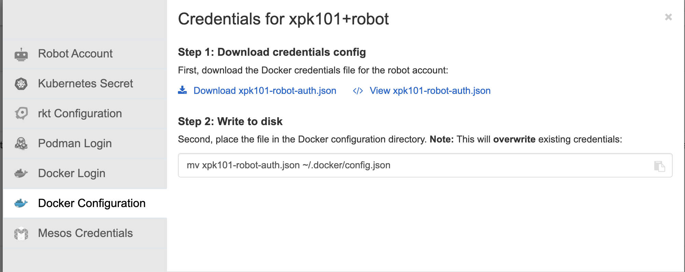

# Clair report form clairctl

## Index
- [Clair report form clairctl](#clair-report-form-clairctl)
  - [Index](#index)
  - [1. Create route for Clair app](#1-create-route-for-clair-app)
    - [1.1 Obtain route hostname](#11-obtain-route-hostname)
  - [2. Obtain clairctl and auth config file](#2-obtain-clairctl-and-auth-config-file)
    - [2.1 Clairctl](#21-clairctl)
    - [2.1 Obtain clair config file](#21-obtain-clair-config-file)
    - [2.2 Copy Config into file](#22-copy-config-into-file)
  - [3. Create Dockerconfig for auth registry](#3-create-dockerconfig-for-auth-registry)
  - [4. Run report](#4-run-report)
    - [Example](#example)

## 1. Create route for Clair app

Type: Edge
TLS: enable
~~~ bash
kind: Route
apiVersion: route.openshift.io/v1
metadata:
  name: app-clair
  labels:
    quay-component: clair-app
    quay-operator/quayregistry: registry
spec:
  to:
    kind: Service
    name: registry-clair-app
    weight: 100
  port:
    targetPort: clair-http
  tls:
    termination: edge
  wildcardPolicy: None
~~~

### 1.1 Obtain route hostname

~~~ bash
oc get route -n quay-operator
NAME                    HOST/PORT                                                                             PATH   SERVICES             PORT         TERMINATION     WILDCARD
app-clair               app-clair-quay-operator.apps.cluster-xxxx.yyyyy.server.com                      registry-clair-app   clair-http   edge            None

~~~

## 2. Obtain clairctl and auth config file

### 2.1 Clairctl

[https://docs.redhat.com/en/documentation/red_hat_quay/3/html/vulnerability_reporting_with_clair_on_red_hat_quay/clair-disconnected-environments#clair-clairctl-ocp](https://docs.redhat.com/en/documentation/red_hat_quay/3/html/vulnerability_reporting_with_clair_on_red_hat_quay/clair-disconnected-environments#clair-clairctl-ocp)

~~~ bash
oc exec registry-clair-app-6ff8446857-27wqp -- cat /usr/bin/clairctl > clairctl
~~~

### 2.1 Obtain clair config file

~~~ bash
oc exec  registry-clair-app-6ff8446857-27wqp -- cat /clair/config.yaml
~~~

### 2.2 Copy Config into file

Create a new config file with auth paramethers
**config.yaml**

~~~ yaml
auth:
    psk:
        iss:
            - quay
            - clairctl
        key: xxxxxxxxyyyyyyyyzzzzz=
~~~

## 3. Create Dockerconfig for auth registry

**~/.docker/config.json**

~~~ bash
vi ~/.docker/config.json
~~~

## 4. Run report

Default text.

~~~ bash
clairctl --config config.yaml \
    report  \
    --host {{ route-clair-app }} \
    {{ registry/image:tag }}
~~~

output json

~~~ bash
clairctl --config config.yaml \
    report  \
    --host {{ route-clair-app }} \
    --out json \
    {{ registry/image:tag }}
~~~

### Example

~~~ bash
clairctl --config config.yaml \
    report  \
    --host app-clair-quay-operator.apps.cluster-xxxx.yyyyy.server.com \
    --out json \
    registry-quay.apps.cluster-xxxx.yyyyy.server.com/xpk101/netcat:latest
~~~

~~~ bash
netcat:latest found pcre2                       10.40-6.el9         CVE-2022-41409
netcat:latest found coreutils-single            8.32-39.el9         CVE-2025-5278
netcat:latest found libpng                      2:1.6.37-12.el9     CVE-2022-3857
netcat:latest found elfutils-debuginfod-client  0.192-5.el9         CVE-2025-1376
netcat:latest found elfutils-debuginfod-client  0.192-5.el9         CVE-2024-25260
netcat:latest found elfutils-debuginfod-client  0.192-5.el9         CVE-2025-1371
netcat:latest found elfutils-debuginfod-client  0.192-5.el9         CVE-2025-1377
netcat:latest found libicu                      67.1-9.el9          CVE-2025-5222 (fixed: 0:67.1-10.el9_6)
netcat:latest found libicu                      67.1-9.el9          CVE-2025-5222 (fixed: 0:67.1-10.el9_6)
netcat:latest found binutils-gold               2.35.2-63.el9       CVE-2023-1579

~~~